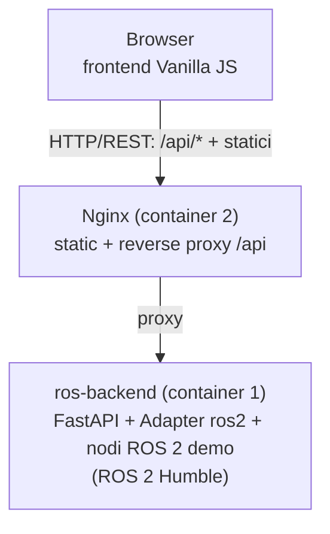

# Documentazione Combo-Debug

Questo e' il **documento radice** della documentazione. Descrive l'applicazione
a grandi linee; i dettagli specifici di ogni area del progetto sono delegati ai
documenti figli, secondo una struttura ad albero (dal generale al particolare).

> Convenzione: ogni file documenta **una sola area/feature**. Quando si aggiunge
> una nuova feature, si crea un nuovo file figlio e lo si collega da qui o dal
> documento di area piu' pertinente.

## Cos'e' Combo-Debug

Combo-Debug e' una web app di monitoraggio e debugging pensata per ecosistemi
misti (servizi web containerizzati + nodi robotici). L'implementazione attuale
si concentra sul monitoraggio di un **ecosistema ROS 2** e fornisce:

- visione in tempo reale dello stato dei nodi (color-coding verde/rosso);
- ispezione delle variabili d'ambiente ROS;
- un log parser centralizzato che evidenzia errori e warning;
- euristiche avanzate (rilevamento spin bloccato).

L'aggiornamento dei dati nel frontend avviene tramite **polling REST**.

## Architettura in breve

Dettagli: [`architecture.md`](architecture.md).

## Mappa della documentazione

- [`architecture.md`](architecture.md) — architettura, container, flussi dati.
- **Backend**
  - [`backend/README.md`](backend/README.md) — panoramica del backend Python.
  - [`backend/api.md`](backend/api.md) — riferimento degli endpoint REST.
  - [`backend/design.md`](backend/design.md) — design pattern e principi SOLID.
- **Frontend**
  - [`frontend/README.md`](frontend/README.md) — struttura e logica del frontend.
- **ROS**
  - [`ros/demo-nodes.md`](ros/demo-nodes.md) — nodi ROS 2 di esempio.
  - [`ros/real-ros.md`](ros/real-ros.md) — aggancio a un ROS 2 reale.
- **Deployment**
  - [`deployment/docker.md`](deployment/docker.md) — build, configurazione, run.

## Per chi eredita il progetto

Se devi estendere l'applicazione, parti da
[`backend/design.md`](backend/design.md): spiega dove inserire nuovi service,
nuove euristiche e nuovi endpoint senza rompere l'architettura esistente.
