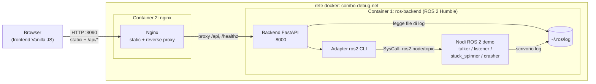
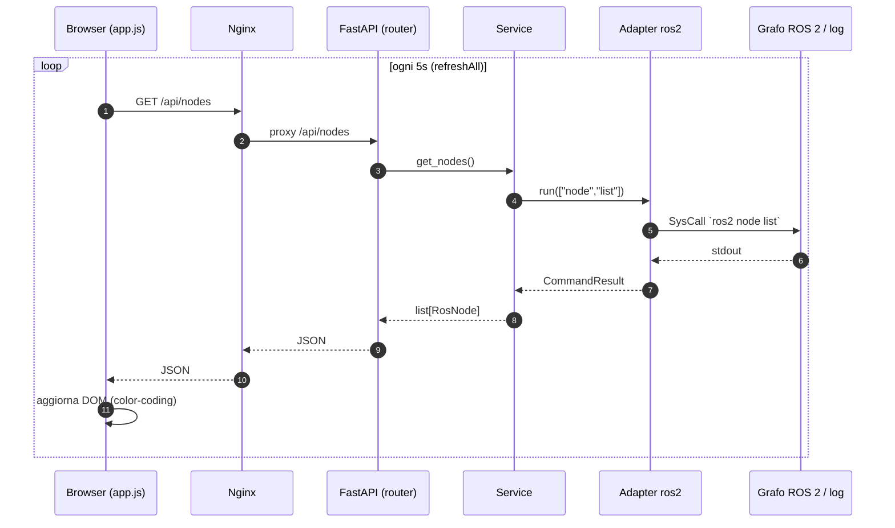

# Architettura

Documento di livello intermedio: descrive i componenti del sistema e come
interagiscono. Per i dettagli implementativi rimanda ai documenti di area.

## Vista dei container (deployment)

## Componenti

### Container 1 — `ros-backend`

Immagine basata su **ROS 2 Humble** (`ros:humble-ros-base`). Contiene:

- **Backend FastAPI**: espone l'API REST consumata dal frontend.
- **Adapter ROS 2**: unico punto che esegue SysCall verso la CLI `ros2`
  (`ros2 node list`, `ros2 node info`, `ros2 topic hz`).
- **Nodi ROS 2 di esempio**: avviati automaticamente per popolare il grafo e
  permettere il test della dashboard.

Il backend deve risiedere **nello stesso container** dei nodi ROS perche':

1. condivide lo stesso `ROS_DOMAIN_ID` / dominio DDS, quindi "vede" lo stesso
   grafo dei nodi;
2. ha accesso diretto all'eseguibile `ros2` e alla cartella dei log
   (`~/.ros/log`).

### Container 2 — `nginx`

Immagine `nginx:alpine`. Svolge due ruoli:

- **web server statico** per il frontend (HTML/CSS/JS);
- **reverse proxy**: inoltra `/api/*` e `/healthz` verso `ros-backend:8000`.

Il browser parla quindi solo con Nginx (una sola origine), evitando problemi di
CORS in produzione.

## Flusso dei dati (polling)

In sintesi:

1. Il browser carica il frontend statico da Nginx.
2. Il frontend esegue **polling** ogni 5s verso `/api/*`.
3. Nginx inoltra le richieste al backend FastAPI.
4. Il backend, tramite l'Adapter, esegue SysCall a `ros2` (o legge i log dal
   filesystem) e restituisce JSON.
5. Il frontend aggiorna il DOM (color-coding, tabelle, log).

## Scelte tecnologiche

| Ambito        | Scelta            | Motivazione                                        |
| ------------- | ----------------- | -------------------------------------------------- |
| Backend       | Python + FastAPI  | Type hints nativi, OpenAPI automatico, leggero.    |
| Interfaccia ROS | SysCall a `ros2` CLI | Nessuna dipendenza di build; isolata in un Adapter sostituibile con `rclpy`. |
| Frontend      | Vanilla JS        | Nessuna toolchain di build, facile da ereditare.   |
| Real-time     | Polling REST      | Semplicita' e robustezza di manutenzione.          |
| Orchestrazione | Docker Compose    | Due container con rete interna dedicata.           |

## Degrado controllato

Se la CLI `ros2` non e' disponibile o un comando va in timeout, l'Adapter non
solleva eccezioni: restituisce un risultato di errore. I service degradano di
conseguenza (es. nodi non rilevati), senza far cadere l'intera API.
