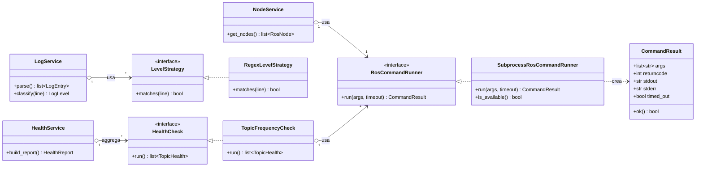

# Design pattern e principi SOLID

Documento foglia: spiega le scelte di design del backend e come estenderlo.

## Diagramma delle classi (UML)

I service dipendono dalle **interfacce** (`RosCommandRunner`, `HealthCheck`,
`LevelStrategy`), mai dalle implementazioni concrete: e' questo che rende il
sistema testabile (fake runner) ed estendibile (nuove strategie).

## Design pattern adottati

### Adapter — `app/adapters/ros_cli.py`
La comunicazione con ROS 2 avviene tramite SysCall alla CLI `ros2`. Tutta questa
logica e' incapsulata nell'Adapter `SubprocessRosCommandRunner`, che implementa
l'interfaccia `RosCommandRunner`. Il resto del codice non sa "come" si parla con
ROS: dipende solo dall'astrazione. Per passare in futuro a un client `rclpy`
nativo basta scrivere un nuovo adapter, senza toccare i service.

### Strategy — log e salute
- **Log** (`log_service.py`): la classificazione di ogni riga e' delegata a una
  lista di `LevelStrategy`. Aggiungere o riordinare le regole non richiede di
  modificare il motore di parsing.
- **Salute** (`health_service.py`): ogni euristica implementa `HealthCheck`.
  `HealthService` si limita ad aggregarne i risultati. Nuove euristiche =
  nuove strategie iniettate.

### Application Factory — `main.py`
`create_app()` costruisce l'istanza FastAPI. Facilita i test con configurazioni
alternative e tiene la configurazione fuori dall'import globale.

### Composition Root — `api/deps.py`
Tutta la costruzione dei service (e delle loro dipendenze) e' centralizzata nei
provider di dependency injection. I router dichiarano `Depends(get_xxx_service)`
e ignorano i dettagli di costruzione.

### Singleton leggero — `Settings` e runner
`get_settings()` e `get_runner()` usano `lru_cache` per condividere un'unica
istanza in tutta l'applicazione.

## Principi SOLID

- **S**ingle Responsibility — un file per area (nodi, env, log, salute, rqt);
  la configurazione e' isolata in `Settings`.
- **O**pen/Closed — Strategy per log/salute permette di estendere senza
  modificare il codice esistente.
- **L**iskov — qualsiasi `RosCommandRunner` (reale o fake) e' interscambiabile;
  i test lo dimostrano usando `FakeRosCommandRunner`.
- **I**nterface Segregation — protocolli minimali (`RosCommandRunner`,
  `HealthCheck`, `LevelStrategy`) espongono solo cio' che serve.
- **D**ependency Inversion — i service dipendono da astrazioni, non da
  `subprocess`; le concrezioni sono iniettate dalla composition root.

## Come estendere

| Obiettivo                          | Dove intervenire                                              |
| ---------------------------------- | ------------------------------------------------------------- |
| Nuovo endpoint                     | Aggiungi un router in `app/api/routes/` e includilo in `routes/__init__.py`. |
| Nuova euristica di salute          | Crea una classe che implementa `HealthCheck` e registrala in `get_health_service`. |
| Nuova regola di classificazione log | Aggiungi una `RegexLevelStrategy` in `log_service.py`.        |
| Backend ROS alternativo (rclpy)    | Implementa `RosCommandRunner` e cambialo in `get_runner`.     |
| Nuovo dato esposto                 | Aggiungi un modello in `models/schemas.py`.                   |
